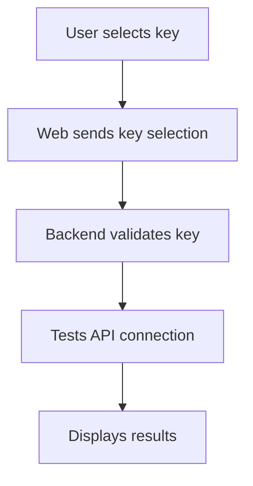

**Key Selection Plan**

## Overview
This plan outlines the steps to implement user-selectable API keys within profiles.

**Phase 1: Data Structure Changes**
```javascript
// profiles.js
{
  profiles: [
    {
      name: "string",
      baseUrl: "string",
      keys: {
        "key1": "value1",
        "key2": "value2"
      }
    }
  ]
}
```

**Phase 2: UI Changes**
1. Update web.js to add endpoint for key list
   ```javascript
   app.get('/profiles/:name/keys', (req, res) => {
     const profile = getProfile(req.params.name);
     res.json(profile.keys);
   });
   ```

2. Modify index.html to add key selection UI
   - Add dropdown next to test button
   - Display list of available keys

**Phase 2: Functionality Changes**
1. Update testProfile function to accept key selection
   ```javascript
   async function testProfile(name, keyName) {
     // implementation
   }
   ```

2. Update API endpoint to accept keyName
   ```javascript
   app.post('/test-profile', async (req, res) => {
     const { name, keyName } = req.body;
     // implementation
   });
   ```

**Phase 4: Testing**
- Manual tests
- Automated tests

**Mermaid Diagram**


Would you like to review this plan and provide feedback before implementation?

## Feedback and Points to Address

Upon review, the plan provides a good high-level overview but requires further detail and consideration in several critical areas to ensure a robust, secure, and complete implementation.

1.  **API Key Security:**
    *   **Issue:** Storing API keys directly in `profiles.js` as plain text is a significant security risk.
    *   **Recommendation:** Implement robust security measures for API keys. This includes:
        *   **Encryption at Rest:** Encrypt API keys when stored and decrypt them only when needed for API calls.
        *   **Secure Storage Mechanism:** Consider using environment variables, a dedicated secure vault service, or a database with proper encryption and access controls instead of a plain JavaScript file for sensitive credentials.
        *   **Access Control:** Ensure only authorized parts of the application can access and use the keys.

2.  **Comprehensive Key Management UI/API:**
    *   **Issue:** The plan focuses solely on *selecting* existing keys and does not cover the full lifecycle of API key management.
    *   **Recommendation:** Extend the plan to include functionality for:
        *   **Adding New Keys:** A user interface and corresponding backend endpoint for users to securely add new API keys to their profiles.
        *   **Editing/Updating Keys:** Features to modify existing key values or names within a profile.
        *   **Deleting Keys:** A mechanism for users to remove API keys from their profiles.

3.  **Robust Error Handling:**
    *   **Issue:** The plan outlines the happy path but lacks explicit details on error handling for various scenarios.
    *   **Recommendation:** Define clear error handling strategies for:
        *   **Profile Not Found:** What happens if a requested profile does not exist?
        *   **Key Not Found:** How are requests handled if the specified `keyName` is not found within a profile?
        *   **API Test Failures:** Implement comprehensive error reporting for issues during the `testProfile` execution (e.g., network errors, invalid API responses, rate limiting).
        *   **Backend Validation Errors:** Provide specific responses for failed backend key validations.

4.  **Data Persistence for `profiles.js`:**
    *   **Issue:** If `profiles.js` is intended as a persistent data store, the plan does not specify how changes (e.g., adding, editing, or deleting keys) are saved back to this file. Direct file manipulation from a web server can lead to data integrity issues.
    *   **Recommendation:** Clarify the persistence mechanism. If `profiles.js` is a file, detail the process for safely writing changes back to it. For a more scalable and robust solution, consider migrating to a proper database (e.g., SQLite, PostgreSQL) to manage profile and key data.

5.  **Detailed Backend Key Validation:**
    *   **Issue:** The Mermaid diagram mentions "Backend validates key," but the plan does not elaborate on the specifics of this validation.
    *   **Recommendation:** Specify the types of backend validation that will occur, such as:
        *   **Format Validation:** Checking if the key adheres to expected patterns or lengths.
        *   **Functional Validation:** Optionally, making a small, non-destructive test call to the target API using the provided key to confirm its validity and active status.

6.  **`getProfile` Function Implementation:**
    *   **Issue:** The plan references a `getProfile` function without providing its implementation or definition.
    *   **Recommendation:** Include a brief outline or reference to where the `getProfile` function is defined and how it retrieves profile data.